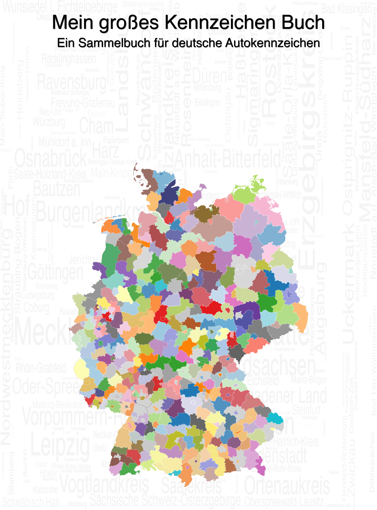

# Mein großes Kennzeichen Buch



Ein Sammelbuch für deutsche Autokennzeichen mit Karten, Checklisten und Rätseln. Zielgruppe sind Kinder im Alter von sechs oder sieben Jahren, da in diesem Alter häufig eine Faszination für Autokennzeichen entsteht. Das Buch enthält einfache Rätsel und kurze Texte und hilft beim Erkennen von Buchstaben und beim Lesenlernen.

Die fertigen PDF-Bücher für alle deutschen Kennzeichen sind in einem separaten Repository verfügbar: [KFZ-Kennzeichen Sammelbücher](https://github.com/TVLuke/kennzeichen_b-cher). Für jedes Kennzeichen gibt es ein individuelles Buch mit regionalspezifischen Informationen.

## Beschreibung

Dieses Projekt erstellt ein PDF-Sammelbuch für deutsche KFZ-Kennzeichen. Das Buch enthält:

- Eine Titelseite mit einer Wortwolke der Regionen
- Karten von Deutschland, die die Regionen der Kennzeichen farblich hervorheben
- Listen mit Checkboxen für alle regulären und seltenen Kennzeichen
- Verschiedene kindgerechte Rätsel:
  - Buchstabenrätsel: Finde und umkreise die Kennzeichenbuchstaben in Städtenamen
  - Worträtsel: Finde Wörter aus Kennzeichenkombinationen
  - Verbindungsrätsel: Verbinde Städte mit ihren Kennzeichen
- Lösungsseiten für alle Rätsel
- Lizenzinformationen und Quellenangaben

Das Buch ist so gestaltet, dass es ausgedruckt und gebunden werden kann. Die Seitenzahl ist immer durch 4 teilbar, und es gibt mindestens eine leere Seite am Ende, was für den Druck optimal ist.

## Voraussetzungen

- Python 3.6 oder höher
- Eine virtuelle Python-Umgebung (z.B. `kfz_env`)
- LaTeX-Installation (pdflatex muss im PATH verfügbar sein)

### Python-Abhängigkeiten

- pandas
- geopandas
- fiona
- matplotlib
- numpy
- shapely
- PyPDF2
- Pillow
- wordcloud

## Installation

1. Klone das Repository:
   ```
   git clone https://github.com/yourusername/kfz-kennzeichen-buch.git
   cd kfz-kennzeichen-buch
   ```

2. Erstelle eine virtuelle Umgebung und installiere die Abhängigkeiten:
   ```
   python -m venv kfz_env
   source kfz_env/bin/activate  # Unter Windows: kfz_env\Scripts\activate
   pip install pandas geopandas fiona matplotlib numpy shapely PyPDF2 Pillow wordcloud
   ```

## Verwendung

Führe einfach das Hauptskript aus:

```
python generate_kfz_maps_neu.py
```

Dies führt folgende Schritte aus:
1. Erstellt das Titelbild mit einer Wortwolke der Regionen
2. Generiert Karten für alle regulären Kennzeichen
3. Erstellt Rätsel und Aktivitäten für Kinder
4. Erstellt ein LaTeX-Dokument mit Listen aller Kennzeichen und Rätseln
5. Kompiliert das LaTeX-Dokument zu einem PDF
6. Fügt das Titelbild und leere Seiten hinzu, um ein druckfertiges PDF zu erstellen

Das fertige PDF wird als `kfz_sammelbuch_HH_final.pdf` gespeichert.

## Einzelne Komponenten

- `generate_kfz_maps_neu.py`: Hauptskript, das den gesamten Prozess steuert, generiert Karten, Rätsel und das LaTeX-Dokument
- `kfz_puzzles.json`: Speichert generierte Rätsel für die Wiederverwendung

## Rätseltypen

Das Buch enthält drei Arten von Rätseln:

1. **Buchstabenrätsel**: Kinder suchen und umkreisen die Buchstaben des Kennzeichens im Städtenamen. Beispiel: Für "HH" werden die Buchstaben H und H in "HAMBURG" umkreist. Die Buchstaben haben einen vergrößerten Abstand für bessere Lesbarkeit.

2. **Worträtsel**: Kinder bilden Wörter aus Kennzeichenkombinationen. Beispiel: "STRASSE" wird aus den Kennzeichen S-TR-AS-SE gebildet.

3. **Verbindungsrätsel**: Kinder verbinden Städtenamen mit ihren entsprechenden Kennzeichen.

## Datenquellen

Das Projekt verwendet zwei Hauptdatenquellen:

1. **KfzKennzeichen-Repository**  
   Quelle: https://github.com/Octoate/KfzKennzeichen/  
   Copyright © 2014 Tim Riemann  
   Lizenz: MIT Lizenz

2. **Verwaltungsgrenzen der Bundesrepublik Deutschland**  
   Quelle: https://mis.bkg.bund.de/trefferanzeige?docuuid=D7BCF56C-ECDF-4672-9C19-8C668C67E378  
   Lizenz: Datenlizenz Deutschland Namensnennung 2.0 (https://www.govdata.de/dl-de/by-2-0)  
   Herausgeber: Bundesamt für Kartographie und Geodäsie

## Datenanforderungen

Die folgenden Dateien musst du herunterladen und im Projektverzeichnis platzieren, bevor du das Skript ausführst:

1. **CSV-Datei mit KFZ-Kennzeichen**
   - Herunterladen von: https://github.com/Octoate/KfzKennzeichen/
   - Dateiname: `kfz-kennz-d.csv`
   - Platzierung: Im Hauptverzeichnis des Projekts (`/Users/tvluke/projects/kfz kennzeichen/kfz-kennz-d.csv`)

2. **Shapefile der Verwaltungsgrenzen**
   - Herunterladen von: https://mis.bkg.bund.de/trefferanzeige?docuuid=D7BCF56C-ECDF-4672-9C19-8C668C67E378
   - Entpacken in: `kfz250.utm32s.shape/kfz250/`
   - Hauptdatei: `KFZ250.shp` (muss in diesem Pfad liegen: `kfz250.utm32s.shape/kfz250/KFZ250.shp`)
   - Alle zugehörigen Dateien (.dbf, .prj, .shx, etc.) müssen im selben Verzeichnis liegen

Diese Dateien sind aufgrund von Lizenz- und Größenbeschränkungen nicht im Repository enthalten und müssen separat heruntergeladen werden.

## Lizenz

### Code (Python-Skripte)
Die Python-Skripte in diesem Projekt stehen unter der **MIT-Lizenz**.

### Inhalte (PDF und Bilder in output_maps)
Das generierte PDF und die Bilder im Verzeichnis `output_maps` sind unter der **[Creative Commons Attribution-NonCommercial 4.0 International License (CC BY-NC 4.0)](https://creativecommons.org/licenses/by-nc/4.0/)** lizenziert.

## Note on Use of LLMs

This code was created using, among other tools, LLM tools.

## Autor

Lukas Ruge © 2025
